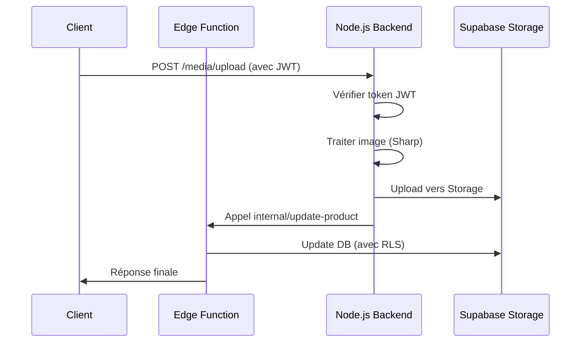

# 🏗️ Architecture 224Solutions - Backend Dual

## 📐 Vue d'ensemble

224Solutions utilise une **architecture backend hybride** combinant deux systèmes complémentaires :

### 🟩 Backend A : Supabase Edge Functions (Principal)
- **Technologie** : Deno Deploy (Edge Runtime)
- **Localisation** : `/supabase/functions/`
- **Rôle** : Backend principal, API rapides, authentification

### 🟦 Backend B : Node.js Express (Secondaire)
- **Technologie** : Node.js + Express
- **Localisation** : `/backend/`
- **Rôle** : Traitement lourd, jobs, médias, cron

---

## 🎯 Répartition des responsabilités

### ✅ Edge Functions Supabase (Backend A)

**Quand utiliser :**
- API CRUD simples et rapides
- Authentification complète (signup, login, JWT)
- Gestion utilisateurs et profils
- Webhooks temps réel
- Notifications push
- Paiements (vérification signatures)
- Opérations protégées par RLS

**Avantages :**
- ⚡ Latence ultra-faible (edge computing)
- 🌍 Distribution mondiale automatique
- 🔐 Intégration native Supabase Auth
- 📊 RLS policies respectées
- 🚀 Auto-scaling Deno Deploy

**Exemples de fonctions :**
```
/supabase/functions/
├── moneroo-initialize-payment/
├── taxi-accept-ride/
├── wallet-operations/
├── create-product/
├── generate-quote-pdf/
└── ...77 fonctions au total
```

---

### ✅ Backend Node.js (Backend B)

**Quand utiliser :**
- Traitement d'images lourd (compression, resize)
- Génération de PDF complexes côté serveur
- Jobs asynchrones et batch processing
- Cron jobs programmés
- Calculs intensifs
- Intégrations externes lourdes
- Scripts systèmes

**Avantages :**
- 💪 Puissance de calcul
- 📦 Écosystème npm complet
- 🔄 Jobs asynchrones (Bull + Redis)
- ⏰ Cron jobs natifs
- 🖼️ Traitement médias (Sharp)

**Architecture :**
```
/backend/
├── src/
│   ├── config/           # Supabase, Logger
│   ├── middlewares/      # Auth JWT, Rate limiting
│   ├── routes/           # API endpoints
│   ├── services/         # Logique métier
│   └── jobs/             # Cron jobs
├── logs/
├── uploads/
└── package.json
```

---

## 🔄 Communication inter-backends

### 1️⃣ Edge Function → Backend Node.js

**Cas d'usage :** Déléguer un traitement lourd

```typescript
// Dans une Edge Function
const response = await fetch('https://your-backend.com/internal/trigger-job', {
  method: 'POST',
  headers: {
    'Content-Type': 'application/json',
    'X-Internal-API-Key': Deno.env.get('INTERNAL_API_KEY') // Clé sécurisée
  },
  body: JSON.stringify({
    jobType: 'process-images',
    payload: { imageIds: [...], operation: 'compress' }
  })
});
```

### 2️⃣ Backend Node.js → Edge Functions

**Cas d'usage :** Appeler une fonction Edge

```javascript
// Dans le backend Node.js
import { supabase } from './config/supabase.js';

const { data, error } = await supabase.functions.invoke('send-notification', {
  body: {
    userId: '123',
    message: 'Job completed'
  }
});
```

### 3️⃣ Frontend → Les deux backends

**Frontend appelle Edge Functions (Supabase client) :**
```typescript
const { data } = await supabase.functions.invoke('create-product', {
  body: productData
});
```

**Frontend appelle Backend Node.js (via fetch) :**
```typescript
const response = await fetch('/api/media/upload', {
  method: 'POST',
  headers: {
    'Authorization': `Bearer ${token}`, // JWT Supabase
    'Content-Type': 'application/json'
  },
  body: formData
});
```

---

## 🔐 Sécurité

### Authentification Unique : Supabase Auth

**Principe :**
- **UN SEUL** système d'auth : Supabase
- Tous les tokens JWT sont générés par Supabase
- Les deux backends **vérifient** ces tokens

**Backend Node.js vérifie les tokens Supabase :**
```javascript
// middleware/auth.js
const { data: { user }, error } = await supabase.auth.getUser(token);
if (error) return res.status(403).json({ error: 'Invalid token' });
req.user = user;
```

### Clé API Interne (Inter-backends)

Pour la communication **backend à backend** uniquement :

```env
# .env (Backend Node.js)
INTERNAL_API_KEY=random-secure-key-here
```

**Vérification :**
```javascript
if (req.headers['x-internal-api-key'] !== process.env.INTERNAL_API_KEY) {
  return res.status(403).json({ error: 'Forbidden' });
}
```

### Protections additionnelles

- ✅ **Helmet** : Headers HTTP sécurisés
- ✅ **CORS** : Origins autorisées uniquement
- ✅ **Rate Limiting** : Anti-abus
- ✅ **RLS Policies** : Supabase Database
- ✅ **Audit Logs** : Traçabilité complète

---

## 📊 Base de données : Supabase PostgreSQL

**UNE SEULE** base de données : Supabase PostgreSQL

Les deux backends y accèdent :

### Edge Functions
```typescript
// Utilise le client Supabase natif
const { data, error } = await supabase
  .from('products')
  .select('*')
  .eq('vendor_id', userId);
```

### Backend Node.js
```javascript
// Utilise le même client Supabase
import { supabase } from './config/supabase.js';

const { data, error } = await supabase
  .from('products')
  .select('*')
  .eq('vendor_id', userId);
```

**Avantages :**
- ✅ Source unique de vérité
- ✅ Pas de synchronisation nécessaire
- ✅ RLS policies respectées partout
- ✅ Migrations centralisées (`/supabase/migrations/`)

---

## 🚀 Scalabilité

### Edge Functions (Auto-scalable)
- **Deno Deploy** gère automatiquement :
  - Distribution mondiale (CDN)
  - Auto-scaling horizontal
  - Load balancing

### Backend Node.js (Scalable horizontalement)
- Plusieurs instances derrière un **load balancer**
- **Stateless** : Pas de session locale
- **Redis** pour cache distribué
- **Bull Queue** pour jobs asynchrones

**Architecture scalable :**
```
                    [Client]
                       |
        +--------------+--------------+
        |                             |
   [Edge Functions]           [Load Balancer]
   (Auto-scale)                      |
        |                   +--------+--------+
        |                   |                 |
        |              [Node.js #1]     [Node.js #2]
        |                   |                 |
        +-------------------+-----------------+
                            |
                    [Supabase PostgreSQL]
                            |
                        [Redis Cache]
```

---

## 📈 Capacité de charge

### 🎯 Objectif : 100M+ utilisateurs

**Phase de croissance et actions nécessaires :**

#### 0 - 100K utilisateurs (Actuel)
- ✅ Architecture actuelle suffit
- Edge Functions + Backend Node.js basique

#### 100K - 1M utilisateurs
- 🔧 Ajouter Redis cache distribué
- 🔧 Bull Queue pour jobs asynchrones
- 🔧 Monitoring avancé (Prometheus)

#### 1M - 10M utilisateurs
- 🔧 Database read replicas (Supabase)
- 🔧 CDN pour assets statiques
- 🔧 Connection pooling optimisé
- 🔧 Plusieurs instances Node.js

#### 10M - 100M utilisateurs
- 🔧 Database sharding (Supabase Enterprise)
- 🔧 Multi-région déployment
- 🔧 Advanced monitoring (Datadog, New Relic)
- 🔧 Supabase Enterprise plan ($2,500+/mois)

---

## 🛠️ Développement

### Démarrage local

**1. Frontend + Edge Functions (Supabase local)**
```bash
npm run dev
```

**2. Backend Node.js**
```bash
cd backend
npm install
npm run dev
```

**3. Les deux ensemble**
```bash
npm run dev:all
```

### Tests

```bash
# Tests Edge Functions
supabase functions serve function-name

# Tests Backend Node.js
cd backend
npm test
```

---

## 📚 Documentation API

### Edge Functions
- Documentation : `/supabase/functions/README.md`
- Endpoints : Voir `supabase/config.toml`

### Backend Node.js
- Documentation : `/backend/README.md`
- Health check : `http://localhost:3001/health`

---

## 🔄 Workflow typique

### Exemple : Upload + traitement d'image



---

## ✅ Bonnes pratiques

1. **Choix du backend** : Simple et rapide → Edge Functions, Lourd → Node.js
2. **Auth unique** : Toujours via Supabase Auth
3. **Base unique** : Supabase PostgreSQL
4. **Logs** : Structurés et centralisés
5. **Sécurité** : JWT + Clé API interne + RLS
6. **Monitoring** : Health checks réguliers
7. **Tests** : Avant chaque déploiement

---

## 📞 Support

- Documentation complète : `/backend/README.md`
- Logs : `/backend/logs/`
- Health check : `http://localhost:3001/health/detailed`

---

**🎯 Résultat : Architecture professionnelle, sécurisée et scalable jusqu'à 100M+ utilisateurs** ✨
