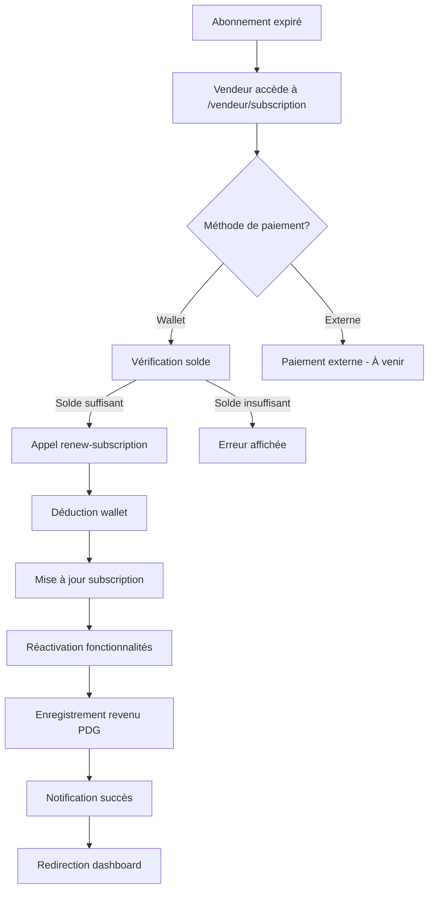

# 📋 Documentation - Système d'expiration automatique des abonnements vendeurs

## 🎯 Vue d'ensemble

Ce système gère automatiquement l'expiration des abonnements vendeurs avec restrictions progressives, notifications et réactivation automatique après paiement.

## 🏗️ Architecture

### 1. Backend - Edge Functions

#### `subscription-expiry-check` (Cron quotidien)
**Chemin**: `supabase/functions/subscription-expiry-check/index.ts`

**Fonction**: Vérification quotidienne des abonnements expirés et application des restrictions

**Actions**:
1. ✅ Marque les abonnements comme `expired` (si `auto_renew = false`)
2. ✅ Marque les abonnements comme `past_due` (si `auto_renew = true`)
3. 🔒 Applique les restrictions aux vendeurs:
   - Désactive le statut `is_verified` du vendeur
   - Suspend les cartes virtuelles (`status = 'suspended'`)
   - Désactive les produits après 7 jours de grâce
4. 📧 Envoie des notifications automatiques

**Période de grâce**: 7 jours (configurable via `GRACE_PERIOD_DAYS`)

**Configuration cron**: À configurer dans Supabase avec pg_cron
```sql
select cron.schedule(
  'subscription-expiry-check-daily',
  '0 2 * * *', -- Tous les jours à 2h du matin
  $$
  select net.http_post(
    url:='https://uakkxaibujzxdiqzpnpr.supabase.co/functions/v1/subscription-expiry-check',
    headers:='{"Content-Type": "application/json", "Authorization": "Bearer YOUR_ANON_KEY"}'::jsonb
  ) as request_id;
  $$
);
```

#### `renew-subscription`
**Chemin**: `supabase/functions/renew-subscription/index.ts`

**Fonction**: Renouvellement d'abonnement avec paiement

**Méthodes de paiement**:
- 💰 **Wallet interne**: Déduction automatique du solde
- 💳 **Paiement externe**: À implémenter (préparé dans l'interface)

**Actions lors du renouvellement**:
1. ✅ Vérifie le montant et le solde wallet
2. 💸 Traite le paiement
3. 📅 Met à jour la période d'abonnement
4. 🔓 Réactive toutes les fonctionnalités:
   - `is_verified = true`
   - Cartes virtuelles: `status = 'active'`
   - Produits: `is_active = true`
5. 💰 Enregistre le revenu PDG
6. 📧 Envoie notification de succès

### 2. Frontend - Hooks & Components

#### Hook: `useVendorRestrictions`
**Chemin**: `src/hooks/useVendorRestrictions.ts`

**Fonction**: Gère l'état des restrictions côté client

**Retourne**:
```typescript
{
  isRestricted: boolean
  canCreateProducts: boolean
  canSendMessages: boolean
  canMakeCalls: boolean
  canTransfer: boolean
  canUseVirtualCard: boolean
  canReceivePayments: boolean
  subscriptionStatus: 'active' | 'expired' | 'past_due' | 'cancelled' | null
  daysUntilExpiry: number | null
  isInGracePeriod: boolean
  gracePeriodDaysRemaining: number | null
}
```

**Real-time**: S'abonne aux changements de la table `subscriptions`

#### Component: `SubscriptionExpiryBanner`
**Chemin**: `src/components/vendor/SubscriptionExpiryBanner.tsx`

**Fonction**: Bannière d'alerte persistante en haut du dashboard

**Affichage**:
- ⚠️ Alerte visuelle (orange/rouge)
- 📋 Liste des fonctionnalités désactivées
- ⏰ Compteur de période de grâce
- 🔄 Bouton "Renouveler maintenant"

**Affichage conditionnel**: Visible uniquement si `isRestricted = true`

#### Component: `RestrictedFeatureWrapper`
**Chemin**: `src/components/vendor/RestrictedFeatureWrapper.tsx`

**Fonction**: Wrapper pour bloquer l'accès aux fonctionnalités

**Usage**:
```tsx
<RestrictedFeatureWrapper 
  feature="products"
  fallbackMessage="Création désactivée"
>
  <ProductManagement />
</RestrictedFeatureWrapper>
```

**Features supportées**:
- `products`: Création de produits
- `messages`: Messagerie
- `calls`: Appels
- `transfer`: Transferts wallet
- `virtualCard`: Carte virtuelle
- `payments`: Réception de paiements

#### Page: `SubscriptionRenewalPage`
**Chemin**: `src/components/vendor/SubscriptionRenewalPage.tsx`

**Fonction**: Interface de renouvellement

**Fonctionnalités**:
- 📊 Affichage statut abonnement actuel
- 💳 Sélection méthode de paiement
- 💰 Vérification solde wallet
- ✅ Confirmation et traitement du paiement
- 🔄 Redirection automatique après succès

**Route**: `/vendeur/subscription`

### 3. Intégration au Dashboard

**Fichier modifié**: `src/pages/VendeurDashboard.tsx`

**Ajouts**:
1. Import de `SubscriptionExpiryBanner` et `SubscriptionRenewalPage`
2. Bannière en sticky en haut du contenu (sous le header)
3. Route `/vendeur/subscription` pour la page de renouvellement

## 🔒 Restrictions appliquées

### Phase 1: Expiration immédiate (Jour 0)
- ❌ Messagerie bloquée (lecture seule)
- ❌ Appels sortants bloqués
- ❌ Transferts wallet bloqués
- ❌ Réception de nouveaux paiements bloquée
- ❌ Carte virtuelle suspendue
- ⚠️ Notification envoyée

### Phase 2: Période de grâce (Jours 1-7)
- ✅ Produits restent visibles
- ✅ Consultation historique possible
- ✅ Lecture des messages
- ⏰ Compteur de jours restants affiché

### Phase 3: Après période de grâce (Jour 8+)
- ❌ Produits masqués (`is_active = false`)
- ❌ Toutes les fonctionnalités bloquées
- 🔓 Données préservées (aucune suppression)

## 🔄 Flux de renouvellement



## 📊 Tables impliquées

### `subscriptions`
- `status`: 'active' | 'expired' | 'past_due' | 'cancelled'
- `current_period_start`: Date de début
- `current_period_end`: Date de fin
- `auto_renew`: Boolean pour renouvellement automatique

### `vendors`
- `is_verified`: Utilisé comme flag de restriction (false = restreint)
- `is_active`: Statut actif du vendeur

### `virtual_cards`
- `status`: 'active' | 'suspended'

### `products`
- `is_active`: Visibilité du produit

### `notifications`
- Notifications d'expiration et de renouvellement

### `revenus_pdg`
- Enregistrement des revenus d'abonnement via `handle_pdg_revenue`

## ⚙️ Configuration

### Variables d'environnement
```env
SUPABASE_URL=https://uakkxaibujzxdiqzpnpr.supabase.co
SUPABASE_SERVICE_ROLE_KEY=your-service-role-key
```

### Période de grâce
**Fichier**: `supabase/functions/subscription-expiry-check/index.ts`
```typescript
const GRACE_PERIOD_DAYS = 7; // Modifiable selon besoin
```

## 🧪 Tests

### Test manuel de l'expiration
```bash
# Appeler manuellement la fonction
curl -X POST https://uakkxaibujzxdiqzpnpr.supabase.co/functions/v1/subscription-expiry-check \
  -H "Authorization: Bearer YOUR_ANON_KEY" \
  -H "Content-Type: application/json"
```

### Test du renouvellement
1. Se connecter avec un vendeur ayant un abonnement expiré
2. La bannière doit apparaître
3. Cliquer sur "Renouveler maintenant"
4. Sélectionner "Wallet"
5. Confirmer le paiement
6. Vérifier la réactivation des fonctionnalités

## 🚀 Déploiement

Les edge functions sont automatiquement déployées avec le code.

**Configuration requise**:
1. ✅ Ajouter le cron job dans Supabase
2. ✅ Vérifier que `SUPABASE_SERVICE_ROLE_KEY` est configurée
3. ✅ Tester la fonction `subscription-expiry-check` manuellement
4. ✅ Vérifier les notifications dans la table `notifications`

## 📝 Notes importantes

### Sécurité
- ✅ Les endpoints utilisent JWT authentication
- ✅ Vérification de l'owner de l'abonnement
- ✅ Utilisation de service role key côté backend
- ✅ RLS policies respectées

### Données préservées
- ✅ **AUCUNE donnée n'est supprimée**
- ✅ Produits: masqués mais pas supprimés
- ✅ Messages: lecture seule conservée
- ✅ Transactions: historique complet
- ✅ Reactivation complète possible

### Performance
- ✅ Real-time subscriptions pour mise à jour instantanée
- ✅ Vérifications groupées dans le cron
- ✅ Notifications par batch

## 🔧 Maintenance

### Logs à surveiller
- Edge function logs: `subscription-expiry-check`
- Edge function logs: `renew-subscription`
- Table `notifications` pour les notifications envoyées
- Table `revenus_pdg` pour les revenus

### Métriques importantes
- Nombre d'abonnements expirés par jour
- Taux de renouvellement
- Solde wallet moyen des vendeurs
- Délai moyen de renouvellement

## 🎨 Interface utilisateur

### Couleurs utilisées
- **Orange**: État d'alerte (expiration)
- **Rouge**: Critique (fonctionnalités bloquées)
- **Vert**: Succès (renouvellement)
- **Jaune**: Avertissement (expiration prochaine)

### Icônes
- ⚠️ AlertTriangle: Alerte expiration
- 🔒 Lock: Fonctionnalité bloquée
- ⏰ Clock: Période de grâce
- 💳 CreditCard: Paiement

## 📞 Support

En cas de problème:
1. Vérifier les logs des edge functions
2. Vérifier l'état de l'abonnement dans la base
3. Vérifier le solde wallet du vendeur
4. Consulter la table `notifications`

---

**Date de création**: 2025
**Version**: 1.0
**Auteur**: 224SOLUTIONS
