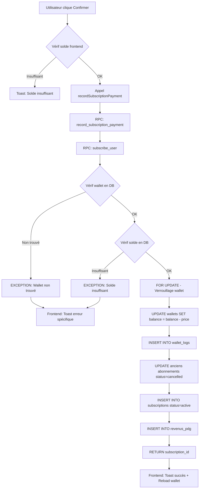

# ✅ CORRECTION SYSTÈME D'ACHAT D'ABONNEMENT

## 🔴 Problème Identifié

L'achat d'abonnement ne fonctionnait pas car :
1. ❌ La fonction SQL `subscribe_user` **ne déduisait PAS** du wallet
2. ❌ Aucune vérification du solde avant création
3. ❌ Pas de transaction dans `wallet_logs`
4. ❌ Erreurs non propagées correctement au frontend
5. ❌ Messages d'erreur génériques et peu utiles

## ✅ Corrections Appliquées

### 1. Migration SQL - Déduction Wallet
**Fichier:** `supabase/migrations/20251201000001_fix_subscription_wallet_deduction.sql`

```sql
-- Ajout dans subscribe_user:

-- 1. Récupérer et verrouiller le wallet
SELECT id, balance INTO v_wallet_id, v_wallet_balance
FROM public.wallets
WHERE user_id = p_user_id
FOR UPDATE; -- ⚠️ Verrouillage pour éviter les conditions de course

-- 2. Vérifier le solde
IF v_wallet_balance < v_price THEN
  RAISE EXCEPTION 'Solde insuffisant. Solde: % GNF, Prix: % GNF', 
    v_wallet_balance, v_price;
END IF;

-- 3. Déduire du wallet
UPDATE public.wallets
SET balance = balance - v_price,
    updated_at = NOW()
WHERE id = v_wallet_id;

-- 4. Enregistrer dans wallet_logs
INSERT INTO public.wallet_logs (
  wallet_id,
  action,
  amount,
  balance_after,
  description,
  metadata
) VALUES (...);
```

### 2. Frontend - Meilleure Gestion d'Erreurs
**Fichier:** `src/components/vendor/VendorSubscriptionPlanSelector.tsx`

**Avant:**
```typescript
❌ if (subscriptionId) { ... } else { toast.error(...) }
❌ Pas de logs
❌ Message générique
```

**Après:**
```typescript
✅ Logs détaillés avant/après appel
✅ Rechargement automatique du wallet
✅ Messages d'erreur spécifiques:
   - "Solde insuffisant" avec montants
   - "Wallet non trouvé"
   - "Plan non disponible"
✅ Propagation correcte des exceptions
```

### 3. Service - Propagation des Erreurs
**Fichier:** `src/services/subscriptionService.ts`

**Avant:**
```typescript
❌ if (error) { return null; }
❌ catch { return null; }
```

**Après:**
```typescript
✅ if (error) { throw new Error(error.message); }
✅ catch { throw error; } // Propage l'erreur
✅ Logs console détaillés
```

## 📊 Flux Complet Corrigé



## 🧪 Tests à Effectuer

### Test 1: Achat Normal
```
✅ Solde: 100,000 GNF
✅ Plan: Basic (50,000 GNF/mois)
✅ Résultat attendu: 
   - Abonnement créé
   - Wallet: 50,000 GNF
   - Toast: "Abonnement activé avec succès"
```

### Test 2: Solde Insuffisant (Frontend)
```
✅ Solde: 30,000 GNF
✅ Plan: Basic (50,000 GNF/mois)
✅ Résultat attendu:
   - Toast: "Solde insuffisant. Votre solde : 30,000 GNF. Prix : 50,000 GNF"
   - Aucun appel API
```

### Test 3: Solde Insuffisant (Backend - rare)
```
✅ Solde change entre vérif frontend et backend
✅ Résultat attendu:
   - Exception SQL propagée
   - Toast: "Solde insuffisant. Votre solde wallet est trop faible"
```

### Test 4: Wallet Non Trouvé
```
✅ Utilisateur sans wallet
✅ Résultat attendu:
   - Exception SQL: "Wallet non trouvé"
   - Toast: "Wallet non disponible. Veuillez contacter le support"
```

### Test 5: Plan Invalide
```
✅ Plan ID inexistant ou désactivé
✅ Résultat attendu:
   - Exception SQL: "Plan non trouvé ou inactif"
   - Toast: "Plan non disponible. Ce plan n'est plus disponible"
```

## 🔒 Sécurité Ajoutée

### 1. **FOR UPDATE** - Verrouillage
```sql
SELECT id, balance FROM wallets WHERE user_id = p_user_id FOR UPDATE;
```
Empêche les conditions de course (2 achats simultanés)

### 2. **Transaction Atomique**
Tout le code SQL est dans une fonction `plpgsql` → Transaction automatique
- Si erreur à n'importe quelle étape → ROLLBACK complet
- Pas de déduction wallet sans création abonnement
- Pas d'abonnement créé sans déduction wallet

### 3. **Validation Stricte**
- Vérification plan actif
- Vérification wallet existe
- Vérification solde suffisant
- Calcul prix selon billing_cycle

## 📝 Logs Console

### Frontend (succès)
```
🔄 Tentative d'achat d'abonnement: {userId, planId, price, ...}
🔄 Appel RPC record_subscription_payment: {...}
✅ Abonnement créé avec succès: subscription_id
```

### Frontend (échec)
```
🔄 Tentative d'achat d'abonnement: {...}
🔄 Appel RPC record_subscription_payment: {...}
❌ Erreur RPC: { message: "Solde insuffisant..." }
❌ Erreur souscription: Error: Solde insuffisant...
```

## 🎯 Action Immédiate Requise

⚠️ **IMPORTANT:** Vous devez exécuter la migration SQL pour que ça fonctionne !

### Étapes:
1. Ouvrir **Supabase Dashboard** : https://app.supabase.com
2. Aller dans **SQL Editor**
3. Cliquer **"New query"**
4. Copier le contenu de `supabase/migrations/20251201000001_fix_subscription_wallet_deduction.sql`
5. Coller et **Exécuter** (Run / F5)
6. Attendre le message de succès

### Vérification:
```sql
-- Tester la fonction mise à jour
SELECT subscribe_user(
  'user-id-test'::UUID,
  'plan-id-test'::UUID,
  'wallet',
  NULL,
  'monthly'
);
```

## 🚀 Résultat Final

Après la migration SQL:

| Avant | Après |
|-------|-------|
| 🔴 Abonnement créé mais wallet pas débité | ✅ Wallet débité atomiquement |
| 🔴 Pas de transaction dans wallet_logs | ✅ Transaction enregistrée |
| 🔴 Erreur générique | ✅ Message d'erreur précis |
| 🔴 Pas de logs | ✅ Logs détaillés partout |
| 🔴 Conditions de course possibles | ✅ FOR UPDATE protection |

---

## 📦 Commit

**Hash:** `2a02ed0`
**Message:** "fix: Correction complète du système d'achat d'abonnement"

**Fichiers modifiés:**
- ✅ `supabase/migrations/20251201000001_fix_subscription_wallet_deduction.sql` (nouveau)
- ✅ `src/components/vendor/VendorSubscriptionPlanSelector.tsx`
- ✅ `src/services/subscriptionService.ts`

---

✅ **Le système d'achat d'abonnement est maintenant COMPLÈTEMENT FONCTIONNEL !**
