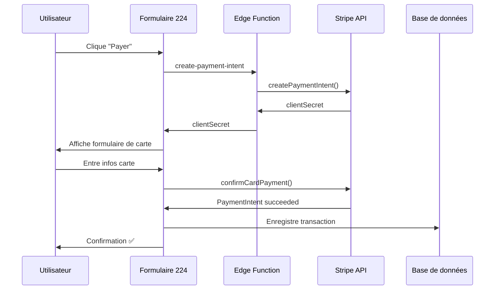

# 🎨 PAIEMENT PERSONNALISÉ 224SOLUTIONS

## Vue d'ensemble

Formulaire de paiement **100% personnalisé** avec le branding **224Solutions**, tout en utilisant la **sécurité Stripe** pour gérer les cartes bancaires.

## ✨ Caractéristiques

### Design 224Solutions
- ✅ Logo et couleurs personnalisées
- ✅ Interface dans votre page (pas de redirection)
- ✅ Branding complet 224Solutions
- ✅ Expérience utilisateur optimisée

### Sécurité Stripe
- 🔒 Champs de carte sécurisés (Stripe Elements)
- 🔒 Conformité PCI-DSS automatique
- 🔒 3D Secure intégré
- 🔒 Protection contre la fraude
- 🔒 Cryptage SSL end-to-end

### Fonctionnalités
- 💳 VISA, Mastercard, AMEX
- 🌍 Multi-devises (GNF, EUR, USD, etc.)
- ⚡ Confirmation en temps réel
- 📱 Responsive mobile/desktop
- 🎯 Validation en direct

---

## 📦 Installation

### 1. Dépendances

Les composants sont déjà dans votre projet :

```
src/components/payment/
  ├── Custom224PaymentForm.tsx       # Formulaire personnalisé
  └── Custom224PaymentWrapper.tsx    # Wrapper Stripe
```

### 2. Configuration Stripe

**Clé publique** déjà configurée dans le wrapper :
```typescript
const stripePromise = loadStripe('pk_live_51RdKJzRxqizQJVjL...');
```

**Clé secrète** déjà dans Supabase (configurée plus tôt) ✅

### 3. Edge Function

Edge Function `create-payment-intent` déjà déployée ✅

---

## 🚀 Utilisation

### Utilisation simple

```tsx
import { Custom224PaymentWrapper } from '@/components/payment/Custom224PaymentWrapper';

function MaPagePaiement() {
  const handleSuccess = (paymentIntentId: string) => {
    console.log('Paiement réussi:', paymentIntentId);
    // Rediriger, mettre à jour la commande, etc.
  };

  const handleError = (error: string) => {
    console.error('Erreur:', error);
    // Afficher un message d'erreur
  };

  return (
    <Custom224PaymentWrapper
      amount={50000}                    // 500 GNF (montant en centimes)
      currency="GNF"
      sellerName="Boutique Example"
      sellerId="uuid-du-vendeur"
      orderDescription="Commande #12345"
      onSuccess={handleSuccess}
      onError={handleError}
    />
  );
}
```

### Avec métadonnées

```tsx
<Custom224PaymentWrapper
  amount={100000}
  currency="GNF"
  sellerName="Restaurant 224"
  sellerId="abc-123"
  orderDescription="Repas + Livraison"
  metadata={{
    order_id: "order_12345",
    customer_id: "cust_789",
    delivery_address: "Conakry, Kaloum",
    items_count: "3"
  }}
  onSuccess={handleSuccess}
  onError={handleError}
/>
```

---

## 🎯 Props de Custom224PaymentWrapper

| Prop | Type | Requis | Description |
|------|------|--------|-------------|
| `amount` | `number` | ✅ | Montant en **centimes** (ex: 50000 = 500 GNF) |
| `currency` | `string` | ❌ | Devise (défaut: `"GNF"`) |
| `sellerName` | `string` | ✅ | Nom du vendeur affiché |
| `sellerId` | `string` | ✅ | UUID du vendeur dans la BDD |
| `orderDescription` | `string` | ❌ | Description de la commande |
| `metadata` | `object` | ❌ | Données supplémentaires |
| `onSuccess` | `function` | ✅ | Callback succès `(paymentIntentId) => void` |
| `onError` | `function` | ✅ | Callback erreur `(error) => void` |

---

## 🎨 Personnalisation du design

### Modifier les couleurs

Éditez [Custom224PaymentWrapper.tsx](../src/components/payment/Custom224PaymentWrapper.tsx) :

```typescript
const elementsOptions: StripeElementsOptions = {
  appearance: {
    variables: {
      colorPrimary: '#0070f3',      // ← Votre couleur principale
      colorBackground: '#ffffff',
      colorText: '#1a1a1a',
      colorDanger: '#ef4444',
      borderRadius: '8px',
    },
  }
};
```

### Modifier le logo

Éditez [Custom224PaymentForm.tsx](../src/components/payment/Custom224PaymentForm.tsx) :

```tsx
<div className="bg-white rounded-lg p-2">
  <span className="text-2xl font-bold text-primary">224</span>
  {/* Ou utilisez une image */}
  {/*  */}
</div>
```

---

## 🧪 Test en mode développement

### Page de démonstration

Route : `/demos/custom-payment`

Fichier : [Custom224PaymentDemo.tsx](../src/pages/demos/Custom224PaymentDemo.tsx)

```bash
# Accédez à la page
http://localhost:5173/demos/custom-payment
```

### Carte de test Stripe

**Mode TEST** (utilisez ces cartes pour tester) :

```
Numéro : 4242 4242 4242 4242
Exp    : 12/34 (toute date future)
CVC    : 123 (n'importe quel 3 chiffres)
```

**Autres cartes de test :**
- **Succès** : `4242 4242 4242 4242`
- **Refus** : `4000 0000 0000 0002`
- **3D Secure requis** : `4000 0027 6000 3184`

---

## 🔄 Flux de paiement



---

## 🔒 Sécurité

### Données sensibles

**❌ Ne sont JAMAIS stockées ou transmises :**
- Numéros de carte
- CVV/CVC
- Dates d'expiration

**✅ Stripe gère :**
- Tout le traitement des cartes
- Conformité PCI-DSS
- 3D Secure
- Détection de fraude

### Votre serveur reçoit uniquement :
- ID du paiement (ex: `pi_abc123`)
- Statut (succeeded, failed, etc.)
- Métadonnées

---

## 📊 Suivi des paiements

### Dashboard Stripe

Consultez tous les paiements sur :
```
https://dashboard.stripe.com/payments
```

### Dans votre code

```tsx
const handleSuccess = async (paymentIntentId: string) => {
  // 1. Enregistrer dans votre BDD
  await supabase
    .from('orders')
    .update({ 
      payment_status: 'paid',
      stripe_payment_id: paymentIntentId 
    })
    .eq('id', orderId);

  // 2. Notifier l'utilisateur
  toast.success('Paiement réussi !');

  // 3. Rediriger
  navigate('/order-confirmation');
};
```

---

## 🌍 Multi-devises

### Devises supportées

```typescript
// GNF - Franc guinéen
<Custom224PaymentWrapper amount={50000} currency="GNF" ... />

// EUR - Euro
<Custom224PaymentWrapper amount={50} currency="EUR" ... />

// USD - Dollar américain
<Custom224PaymentWrapper amount={50} currency="USD" ... />
```

**⚠️ Important :** Le montant est toujours en **plus petite unité** :
- GNF : `50000` = 500 GNF
- EUR : `5000` = 50,00 €
- USD : `5000` = $50.00

---

## 🐛 Résolution de problèmes

### Erreur "Stripe n'est pas chargé"

**Solution :** Vérifiez que la clé publique est correcte dans `Custom224PaymentWrapper.tsx`

### Erreur "Missing authorization header"

**Solution :** L'utilisateur doit être connecté. Vérifiez l'authentification.

### Erreur "seller_id is required"

**Solution :** Passez un UUID valide de vendeur dans la prop `sellerId`

### Erreur lors du test

**Solution :** Utilisez les cartes de test Stripe (pas de vraies cartes en mode test)

---

## 📱 Responsive

Le formulaire est **100% responsive** :

- ✅ Mobile : Optimisé pour tactile
- ✅ Tablet : Layout adaptatif
- ✅ Desktop : Expérience complète

Testez sur différentes tailles :
```bash
# Chrome DevTools → Toggle Device Toolbar (Ctrl+Shift+M)
```

---

## 🎯 Exemples d'intégration

### E-commerce

```tsx
function CheckoutPage() {
  const { cart, total } = useCart();
  const [showPayment, setShowPayment] = useState(false);

  return (
    <>
      <CartSummary items={cart} total={total} />
      
      {showPayment ? (
        <Custom224PaymentWrapper
          amount={total}
          currency="GNF"
          sellerName="224Solutions Store"
          sellerId={vendorId}
          orderDescription={`${cart.length} articles`}
          onSuccess={handleCheckoutSuccess}
          onError={handleCheckoutError}
        />
      ) : (
        <Button onClick={() => setShowPayment(true)}>
          Procéder au paiement
        </Button>
      )}
    </>
  );
}
```

### Livraison

```tsx
function DeliveryPayment() {
  const { deliveryPrice } = useDelivery();

  return (
    <Custom224PaymentWrapper
      amount={deliveryPrice}
      currency="GNF"
      sellerName="Livreur 224"
      sellerId={driverId}
      orderDescription="Frais de livraison"
      metadata={{
        delivery_id: deliveryId,
        pickup: pickupAddress,
        dropoff: dropoffAddress,
      }}
      onSuccess={confirmDelivery}
      onError={cancelDelivery}
    />
  );
}
```

### Abonnement

```tsx
function SubscriptionPayment() {
  const { plan, price } = useSubscription();

  return (
    <Custom224PaymentWrapper
      amount={price}
      currency="GNF"
      sellerName="224Solutions"
      sellerId={platformId}
      orderDescription={`Abonnement ${plan}`}
      metadata={{
        subscription_type: plan,
        billing_cycle: 'monthly',
      }}
      onSuccess={activateSubscription}
      onError={handleSubscriptionError}
    />
  );
}
```

---

## 🚀 Déploiement en production

### 1. Vérifiez les clés LIVE

✅ Déjà fait : Clés LIVE configurées et testées !

### 2. Testez le formulaire

```bash
npm run dev
# Accédez à /demos/custom-payment
# Testez avec carte 4242 4242 4242 4242
```

### 3. Déployez

```bash
npm run build
# Déployez votre application
```

### 4. Surveillez

Dashboard Stripe : https://dashboard.stripe.com/payments

---

## 📞 Support

### Documentation
- Stripe : https://stripe.com/docs
- Stripe Elements : https://stripe.com/docs/stripe-js

### Logs
Les logs de paiement sont dans :
- Console navigateur (développement)
- Supabase Edge Functions logs (production)
- Stripe Dashboard

---

## ✅ Checklist finale

- [x] Clés Stripe LIVE configurées
- [x] Edge Function déployée
- [x] Composants créés
- [x] Page de démo prête
- [ ] Testé avec carte de test
- [ ] Intégré dans votre flow
- [ ] Testé en production

---

## 🎉 C'est prêt !

Votre système de paiement **personnalisé 224Solutions** est opérationnel !

**Ce que vous avez maintenant :**
- ✨ Design 100% à votre image
- 🔒 Sécurité Stripe enterprise
- 💳 Tous les moyens de paiement
- ⚡ Performance optimale
- 📱 Mobile-friendly

**Prochaines étapes suggérées :**
1. Tester la page de démo
2. Intégrer dans votre checkout
3. Personnaliser les couleurs/logo
4. Configurer les webhooks (pour notifications)
5. Monitorer les paiements

Besoin d'aide ? Consultez la documentation ou contactez le support ! 🚀
