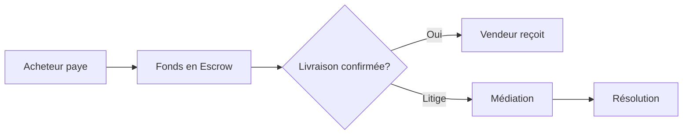

# 🚀 Vista Flows by 224Solutions

> **La Super App E-commerce & Services pour l'Afrique Francophone**

[](https://github.com/224solutions/vista-flows)
[](https://www.typescriptlang.org/)
[](https://reactjs.org/)
[](https://supabase.com/)
[](https://web.dev/progressive-web-apps/)

---

## 🌟 Vue d'Ensemble

**Vista Flows** est une plateforme tout-en-un conçue spécifiquement pour les marchés africains francophones. Elle combine :

- 🛒 **E-commerce** avec marketplace multi-vendeurs
- 🚕 **Taxi-Moto** avec géolocalisation en temps réel  
- 🚚 **Livraison** avec suivi GPS
- 💼 **Services professionnels** à la demande
- 💰 **Wallet digital** avec Mobile Money intégré

---

## ✨ Fonctionnalités Clés

### 🔐 Sécurité de Niveau Entreprise

| Fonctionnalité | Description |
|----------------|-------------|
| **Chiffrement AES-256** | Données offline cryptées avec IndexedDB |
| **Row Level Security (RLS)** | Isolation complète des données par utilisateur |
| **Détection de fraude ML** | Algorithmes d'apprentissage automatique |
| **Audit Logs** | Traçabilité complète des actions |
| **Rate Limiting** | Protection contre les abus |
| **KYC Vendeurs** | Vérification d'identité obligatoire |

### 📴 Mode Offline Révolutionnaire

```
✅ Fonctionne sans connexion internet
✅ Synchronisation automatique au retour en ligne
✅ Données cryptées localement
✅ POS vendeur 100% offline
✅ PWA installable sur mobile
```

**Pourquoi c'est important ?**
> En Afrique, la connectivité peut être intermittente. Vista Flows garantit une expérience fluide même en zone rurale avec une connexion instable.

### 💳 Paiements Locaux Intégrés

| Provider | Statut | Pays |
|----------|--------|------|
| **Orange Money** | ✅ Actif | Guinée, Côte d'Ivoire, Mali, Sénégal |
| **MTN MoMo** | ✅ Actif | Guinée, Ghana, Cameroun |
| **Moov Money** | 🔜 Bientôt | Côte d'Ivoire, Bénin, Togo |
| **Wave** | 🔜 Bientôt | Sénégal, Côte d'Ivoire |
| **Carte bancaire** | ✅ Actif | Via Stripe |
| **Wallet 224** | ✅ Actif | Tous pays |

### 🤖 Intelligence Artificielle

- **CopiloteChat** : Assistant IA intégré pour aide aux achats
- **Recommandations ML** : Produits suggérés selon comportement
- **Détection de fraude** : Analyse en temps réel des transactions
- **Analyse prédictive** : Tendances et stocks optimisés

### 🔄 Système d'Escrow Sécurisé



**Avantages :**
- Protection acheteur ET vendeur
- Résolution automatique des litiges
- Commission transparente

---

## 🏗️ Architecture Technique

### Stack Technologique

```
Frontend:
├── React 18.3 + TypeScript 5
├── Vite 7.2 (build ultra-rapide)
├── TailwindCSS + shadcn/ui
├── React Router 7
└── PWA Service Worker v9

Backend:
├── Supabase (PostgreSQL + Auth + Storage)
├── Edge Functions (Deno)
├── Node.js Backend (Express)
└── Redis Cache

Intégrations:
├── Stripe (Paiements carte)
├── ChapChapPay/Djomy (Mobile Money)
├── Agora (Appels vidéo)
├── Mapbox (Cartes)
└── Firebase (Notifications push)
```

### Performances

| Métrique | Valeur |
|----------|--------|
| Lighthouse Score | 95+ |
| First Contentful Paint | < 1.5s |
| Time to Interactive | < 3s |
| Bundle Size (gzipped) | < 500KB |
| Modules transformés | 5050+ |

---

## 👥 Rôles & Interfaces

Vista Flows propose **15+ interfaces spécialisées** :

| Rôle | Description | Fonctionnalités clés |
|------|-------------|---------------------|
| **Client** | Acheteur | Catalogue, panier, commandes, wallet |
| **Vendeur** | E-commerçant | Produits, stats, POS, agents |
| **Agent** | Commercial terrain | Inscriptions, commissions |
| **Chauffeur** | Taxi/Moto | Courses, navigation, revenus |
| **Livreur** | Delivery | Tournées, itinéraires |
| **Bureau Syndicat** | Gestion transports | Véhicules, membres, badges |
| **PDG** | Super Admin | Tout accès, analytics globaux |
| **Admin** | Modération | Utilisateurs, litiges, config |

---

## 🌍 Adapté à l'Afrique

### Devises supportées

- 🇬🇳 GNF (Franc Guinéen)
- 🇨🇮 XOF (Franc CFA BCEAO)
- 🇨🇲 XAF (Franc CFA BEAC)
- 🇺🇸 USD (Dollar US)
- 🇪🇺 EUR (Euro)

### Langues

- 🇫🇷 Français (langue principale)
- 🇬🇧 English (en cours)
- 🇬🇳 Soussou, Malinké, Peul (prévu)

### Optimisations locales

- ✅ Faible bande passante : Images optimisées, lazy loading
- ✅ Mode offline complet
- ✅ SMS fallback pour notifications
- ✅ Paiements Mobile Money natifs
- ✅ Support WhatsApp Business (prévu)

---

## 📊 Métriques de Sécurité

| Critère | Score |
|---------|-------|
| Chiffrement données | ✅ AES-256 |
| Authentification | ✅ MFA disponible |
| RLS Coverage | ✅ 100% tables |
| Audit Logging | ✅ Complet |
| Vulnerability Scan | ✅ Continu |
| Bug Bounty | ✅ Programme actif |

---

## 🚀 Démarrage Rapide

### Prérequis

- Node.js 18+
- npm ou bun
- Compte Supabase

### Installation

```bash
# Cloner le repo
git clone https://github.com/224solutions/vista-flows.git
cd vista-flows

# Installer les dépendances
npm install

# Configurer les variables d'environnement
cp .env.example .env.local
# Éditer .env.local avec vos clés Supabase

# Lancer en développement
npm run dev
```

### Build Production

```bash
npm run build
npm run preview
```

---

## 📁 Structure du Projet

```
vista-flows/
├── src/
│   ├── components/     # Composants React
│   │   ├── admin/      # Interface admin
│   │   ├── client/     # Interface client
│   │   ├── vendor/     # Interface vendeur
│   │   ├── ml/         # Composants ML/IA
│   │   └── ...
│   ├── hooks/          # Hooks React personnalisés
│   ├── services/       # Services métier
│   │   ├── ml/         # ML Recommendations
│   │   ├── payment/    # Paiements
│   │   └── ...
│   ├── lib/            # Utilitaires
│   │   ├── offlineDB.ts    # IndexedDB crypté
│   │   ├── encryption.ts   # Chiffrement AES
│   │   └── ...
│   └── pages/          # Pages principales
├── supabase/
│   ├── functions/      # Edge Functions
│   └── migrations/     # Migrations SQL
├── backend/            # Backend Node.js
└── public/             # Assets statiques
```

---

## 🤝 Contribuer

Nous accueillons les contributions ! Voir [CONTRIBUTING.md](CONTRIBUTING.md).

### Bug Bounty 🐛

Vous avez trouvé une vulnérabilité ? 
- Récompenses jusqu'à **$5,000**
- Voir notre [programme Bug Bounty](docs/BUG_BOUNTY.md)

---

## 📜 Licence

Propriétaire - © 2024-2026 224Solutions. Tous droits réservés.

---

## 📞 Contact

- **Site Web** : [224solutions.com](https://224solutions.com)
- **Email** : contact@224solutions.com
- **Support** : support@224solutions.com

---

<div align="center">

**Construit avec ❤️ en Guinée 🇬🇳 pour l'Afrique 🌍**

</div>
