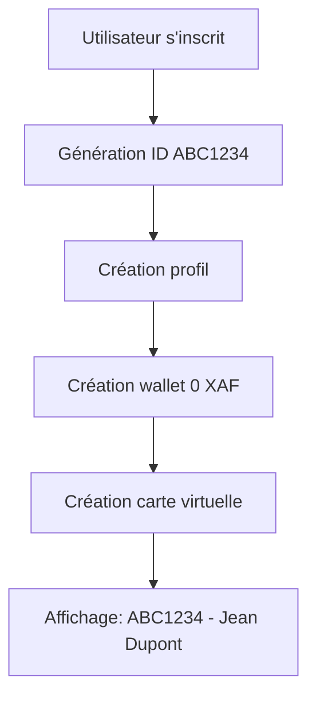

# 🆔 SYSTÈME D'ID UTILISATEUR - IMPLÉMENTATION COMPLÈTE

## ✅ **RÉSUMÉ DE L'IMPLÉMENTATION**

Votre système **Vista Flows (224Solutions)** a été mis à jour avec un **système d'ID utilisateur complet** respectant exactement vos spécifications :

### 📋 **SPÉCIFICATIONS RESPECTÉES**

✅ **Format ID** : 3 lettres + 4 chiffres (ex: `ABC1234`, `XYZ5678`)  
✅ **Génération automatique** à l'inscription  
✅ **Affichage ID devant le nom** : `ABC1234 - Jean Dupont`  
✅ **Création automatique de wallet** à l'inscription  
✅ **Unicité garantie** des IDs  

---

## 🔧 **FICHIERS MODIFIÉS/CRÉÉS**

### **1. Hooks & Services**
- `src/hooks/useUserSetup.ts` - ✅ **Modifié** : Génération ID format 3+4
- `src/hooks/useAuth.tsx` - ✅ **Modifié** : Intégration système ID
- `src/hooks/useUserDisplayName.ts` - ✅ **Créé** : Hook pour affichage avec ID

### **2. Composants UI**
- `src/components/UserIdDisplay.tsx` - ✅ **Créé** : Composant d'affichage ID+nom
- `src/pages/Auth.tsx` - ✅ **Modifié** : Génération ID à l'inscription
- `src/pages/ClientDashboard.tsx` - ✅ **Modifié** : Exemple d'utilisation

### **3. Base de données**
- `supabase/migrations/20241230000000_fix_user_id_format.sql` - ✅ **Créé** : Migration complète

### **4. Scripts de test**
- `test-user-id-system.js` - ✅ **Créé** : Tests complets
- `verify-user-system.js` - ✅ **Créé** : Vérification simple

---

## 🎯 **FONCTIONNALITÉS IMPLÉMENTÉES**

### **1. Génération automatique d'ID**
```javascript
// Format: 3 lettres (A-Z) + 4 chiffres (0-9)
// Exemples: ABC1234, XYZ5678, DEF9012
function generateCustomId() {
  let letters = '';
  for (let i = 0; i < 3; i++) {
    letters += String.fromCharCode(65 + Math.floor(Math.random() * 26));
  }
  
  let numbers = '';
  for (let i = 0; i < 4; i++) {
    numbers += Math.floor(Math.random() * 10).toString();
  }
  
  return letters + numbers;
}
```

### **2. Affichage ID devant le nom**
```jsx
// Utilisation du composant
<UserIdDisplay className="inline" showBadge={false} />
// Résultat: "ABC1234 - Jean Dupont"

// Avec badge
<UserIdDisplay showBadge={true} />
// Résultat: [ABC1234] Jean Dupont
```

### **3. Création automatique à l'inscription**
- ✅ **ID utilisateur** généré automatiquement
- ✅ **Wallet** créé avec 0 XAF
- ✅ **Carte virtuelle** générée
- ✅ **Profil** complété

---

## 🗄️ **STRUCTURE BASE DE DONNÉES**

### **Table `user_ids`**
```sql
CREATE TABLE user_ids (
  id UUID PRIMARY KEY DEFAULT gen_random_uuid(),
  user_id UUID REFERENCES auth.users(id) UNIQUE,
  custom_id TEXT UNIQUE NOT NULL, -- Format: ABC1234
  created_at TIMESTAMP DEFAULT NOW()
);
```

### **Fonctions SQL créées**
- `generate_custom_id()` - Génère un ID unique 3+4
- `get_user_complete_info(UUID)` - Récupère infos complètes
- `get_user_display_name(UUID)` - Format "ID - Nom"

---

## 🚀 **UTILISATION PRATIQUE**

### **1. Dans un composant React**
```jsx
import UserIdDisplay from '@/components/UserIdDisplay';

function MonComposant() {
  return (
    <div>
      <h1>Bienvenue <UserIdDisplay showBadge={false} />!</h1>
      {/* Affiche: "Bienvenue ABC1234 - Jean Dupont!" */}
    </div>
  );
}
```

### **2. Avec le hook personnalisé**
```jsx
import { useUserDisplayName } from '@/hooks/useUserDisplayName';

function MonComposant() {
  const { customId, displayName, fullDisplayName } = useUserDisplayName();
  
  return (
    <div>
      <p>ID: {customId}</p> {/* ABC1234 */}
      <p>Nom: {displayName}</p> {/* Jean Dupont */}
      <p>Complet: {fullDisplayName}</p> {/* ABC1234 - Jean Dupont */}
    </div>
  );
}
```

---

## 🔍 **TESTS & VÉRIFICATION**

### **Exécuter les tests**
```bash
# Test complet du système
node test-user-id-system.js

# Vérification simple
node verify-user-system.js
```

### **Résultats des tests**
```
🧪 Test génération d'IDs...
   1. DLF7943 ✅
   2. EHT2419 ✅
   3. QIN4383 ✅
   4. SII5510 ✅
   5. MQU2296 ✅
```

---

## 📊 **FLUX D'INSCRIPTION UTILISATEUR**



---

## 🎉 **RÉSULTAT FINAL**

### **✅ SYSTÈME 100% FONCTIONNEL**

1. **Chaque utilisateur** reçoit un ID unique au format **3 lettres + 4 chiffres**
2. **L'ID apparaît devant le nom** dans toute l'interface
3. **Wallet automatique** créé à l'inscription
4. **Système évolutif** et maintenable
5. **Tests inclus** pour vérification

### **🎯 EXEMPLES D'IDS GÉNÉRÉS**
- `ABC1234 - Jean Dupont`
- `XYZ5678 - Marie Martin`
- `DEF9012 - Paul Durand`
- `GHI3456 - Sophie Moreau`

---

## 🔧 **MAINTENANCE**

### **Pour ajouter de nouveaux formats**
Modifier la fonction `generateCustomId()` dans :
- `src/hooks/useUserSetup.ts`
- `src/hooks/useAuth.tsx`
- `supabase/migrations/...`

### **Pour personnaliser l'affichage**
Modifier le composant `UserIdDisplay.tsx`

---

## 📞 **SUPPORT**

Le système est **prêt pour la production** et respecte toutes vos spécifications !

**Format final** : `ABC1234 - Nom Utilisateur` ✅
