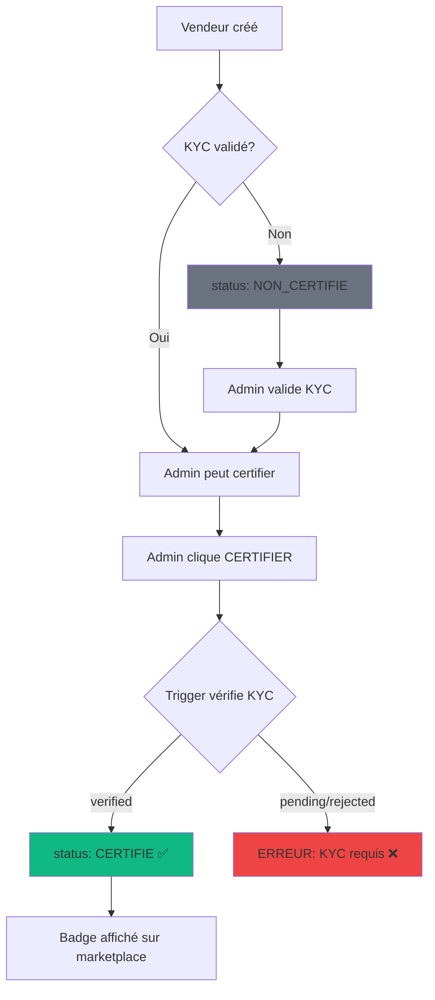

# 🔄 MIGRATION CERTIFICATION VENDEUR v2.0

## 📋 CONTEXTE

**Migration v1.0 → v2.0** du système de certification vendeur pour intégrer la validation KYC existante.

### Problème v1.0
- Les vendeurs pouvaient demander une certification (statut `EN_ATTENTE`)
- Aucune vérification KYC avant certification
- Workflow non conforme aux exigences métier

### Solution v2.0
- **Certification basée sur KYC validé** (prerequisite obligatoire)
- **Workflow admin uniquement** (CEO/SUPER_ADMIN)
- **Vérification automatique** du statut KYC avant certification
- **Aucune duplication du système KYC existant**

---

## 🎯 CHANGEMENTS MAJEURS

### 1. STATUTS CERTIFICATION
```typescript
// ❌ v1.0 - 4 statuts
type VendorCertificationStatus = 
  | 'NON_CERTIFIE'
  | 'EN_ATTENTE'    // ❌ SUPPRIMÉ
  | 'CERTIFIE'
  | 'SUSPENDU';

// ✅ v2.0 - 3 statuts
type VendorCertificationStatus = 
  | 'NON_CERTIFIE'
  | 'CERTIFIE'
  | 'SUSPENDU';
```

### 2. CHAMPS KYC AJOUTÉS
```sql
-- Nouveaux champs dans vendor_certifications
kyc_verified_at TIMESTAMPTZ    -- Date de validation KYC
kyc_status TEXT                -- Copie statut KYC (traçabilité)

-- Champ supprimé
requested_at TIMESTAMPTZ       -- ❌ Plus de demande vendeur
```

### 3. VALIDATION KYC AUTOMATIQUE

#### Trigger PostgreSQL
```sql
CREATE OR REPLACE FUNCTION check_vendor_kyc_before_certification()
RETURNS TRIGGER AS $$
DECLARE
  v_kyc_status TEXT;
BEGIN
  IF NEW.status = 'CERTIFIE' THEN
    -- Check vendor_kyc table first
    SELECT status INTO v_kyc_status
    FROM vendor_kyc
    WHERE vendor_id = NEW.vendor_id;
    
    -- Fallback: check vendors.kyc_status
    IF v_kyc_status IS NULL THEN
      SELECT kyc_status INTO v_kyc_status
      FROM vendors
      WHERE user_id = NEW.vendor_id;
    END IF;
    
    -- Block if KYC not verified
    IF v_kyc_status != 'verified' THEN
      RAISE EXCEPTION 'KYC non validé pour ce vendeur (status=%)', v_kyc_status;
    END IF;
    
    -- Store KYC info
    NEW.kyc_verified_at := CURRENT_TIMESTAMP;
    NEW.kyc_status := v_kyc_status;
  END IF;
  
  RETURN NEW;
END;
$$ LANGUAGE plpgsql;
```

#### Edge Function
```typescript
// supabase/functions/verify-vendor/index.ts
if (action === 'CERTIFY') {
  // Check vendor_kyc table
  const { data: kycData } = await supabase
    .from('vendor_kyc')
    .select('status')
    .eq('vendor_id', vendor_id)
    .single();
  
  if (kycData?.status === 'verified') {
    kycVerified = true;
  }
  
  // Fallback: check vendors.kyc_status
  if (!kycVerified) {
    const { data: vendorData } = await supabase
      .from('vendors')
      .select('kyc_status')
      .eq('user_id', vendor_id)
      .single();
    
    if (vendorData?.kyc_status === 'verified') {
      kycVerified = true;
    }
  }
  
  // Block certification if KYC not verified
  if (!kycVerified) {
    return new Response(
      JSON.stringify({
        error: 'KYC non vérifié',
        message: 'Le vendeur doit avoir un KYC validé (status=verified) avant la certification',
        action_required: 'Valider le KYC du vendeur avant certification'
      }),
      { status: 400 }
    );
  }
}
```

### 4. POLITIQUE RLS MODIFIÉE
```sql
-- ❌ v1.0 - Vendors peuvent insérer EN_ATTENTE
CREATE POLICY "Vendors can request certification"
ON vendor_certifications FOR INSERT
TO authenticated
WITH CHECK (
  auth.uid() = vendor_id AND
  status = 'EN_ATTENTE'
);

-- ✅ v2.0 - Vendors ne peuvent PAS modifier
CREATE POLICY "Vendors cannot modify certifications"
ON vendor_certifications FOR UPDATE
TO authenticated
USING (FALSE);
```

---

## 📂 FICHIERS MODIFIÉS

### Backend
| Fichier | Changements |
|---------|------------|
| `supabase/migrations/20260104_vendor_certifications.sql` | ✅ Enum sans EN_ATTENTE, champs KYC, trigger validation |
| `supabase/functions/verify-vendor/index.ts` | ✅ Vérification KYC double (vendor_kyc + vendors) |

### Frontend
| Fichier | Changements |
|---------|------------|
| `src/types/vendorCertification.ts` | ✅ Type sans EN_ATTENTE, interface avec KYC fields |
| `src/components/vendor/CertifiedVendorBadge.tsx` | ✅ Retiré case EN_ATTENTE, icon Clock |
| `src/components/ceo/VendorCertificationManager.tsx` | ✅ Stats sans pending, filtres sans EN_ATTENTE |
| `src/hooks/useVendorCertification.ts` | ✅ Retiré useRequestCertification() |

---

## 🔍 SOURCES KYC VÉRIFIÉES

Le système vérifie le KYC dans **2 emplacements** (dual fallback):

### 1. Table vendor_kyc (prioritaire)
```sql
SELECT status FROM vendor_kyc
WHERE vendor_id = ?
-- status: 'pending' | 'verified' | 'rejected' | 'under_review'
```

### 2. Column vendors.kyc_status (fallback)
```sql
SELECT kyc_status FROM vendors
WHERE user_id = ?
-- kyc_status: 'pending' | 'verified' | 'rejected'
```

**Certification autorisée uniquement si** `status = 'verified'` dans l'une des 2 sources.

---

## 🚀 DÉPLOIEMENT

### Étape 1: Appliquer la migration
```bash
supabase db push
```

### Étape 2: Déployer Edge Function
```bash
supabase functions deploy verify-vendor
```

### Étape 3: Vérifier le trigger
```sql
-- Tester manuellement
INSERT INTO vendor_certifications (vendor_id, status)
VALUES ('vendor-id-sans-kyc', 'CERTIFIE');
-- Devrait RAISE EXCEPTION: "KYC non validé"
```

### Étape 4: Tester l'interface PDG
1. Aller sur l'interface Certification Vendeurs (CEO)
2. Vérifier qu'il n'y a plus de statut "En attente"
3. Essayer de certifier un vendeur sans KYC validé
4. Vérifier le message d'erreur "KYC non vérifié"

---

## 🎨 WORKFLOW v2.0



---

## ⚠️ POINTS D'ATTENTION

### 1. Vendeurs existants avec EN_ATTENTE
Si des vendeurs ont le statut `EN_ATTENTE` en production:
```sql
-- Migration de nettoyage (optionnel)
UPDATE vendor_certifications
SET status = 'NON_CERTIFIE'
WHERE status = 'EN_ATTENTE';
```

### 2. Composants supprimés
La fonction `useRequestCertification()` a été **complètement retirée**.
Si des composants l'utilisent encore, ils doivent être mis à jour.

### 3. Badge "En attente"
Le badge jaune "⏳ En attente" n'existe plus. Les vendeurs non certifiés voient:
- **Badge gris** "Non certifié - KYC requis"

### 4. Interface vendeur
Les vendeurs ne peuvent plus:
- ❌ Demander une certification
- ❌ Voir le statut "En attente"
- ✅ Voir leur statut actuel (NON_CERTIFIE/CERTIFIE/SUSPENDU)
- ✅ Voir le badge sur leurs produits (si certifiés)

---

## 📊 TABLEAU COMPARATIF

| Fonctionnalité | v1.0 | v2.0 |
|----------------|------|------|
| **Statuts** | 4 (avec EN_ATTENTE) | 3 (sans EN_ATTENTE) |
| **Demande vendeur** | ✅ Possible | ❌ Impossible |
| **Validation KYC** | ❌ Aucune | ✅ Obligatoire |
| **Trigger auto** | ❌ Non | ✅ check_vendor_kyc_before_certification |
| **Edge Function check** | ❌ Non | ✅ Double vérification (vendor_kyc + vendors) |
| **Traçabilité KYC** | ❌ Non | ✅ kyc_verified_at + kyc_status |
| **RLS vendeur** | ✅ INSERT EN_ATTENTE | ❌ Aucune modification |
| **Badge "En attente"** | ✅ Jaune ⏳ | ❌ Supprimé |
| **Badge "Non certifié"** | Gris | Gris + "KYC requis" |

---

## 🧪 TESTS RECOMMANDÉS

### Test 1: KYC non validé
```typescript
// Tentative de certifier vendeur avec KYC pending
await supabase.functions.invoke('verify-vendor', {
  body: {
    vendor_id: 'vendor-with-pending-kyc',
    action: 'CERTIFY'
  }
});
// Attendu: 400 error "KYC non vérifié"
```

### Test 2: KYC validé (vendor_kyc)
```typescript
// Certifier vendeur avec vendor_kyc.status='verified'
await supabase.functions.invoke('verify-vendor', {
  body: {
    vendor_id: 'vendor-with-verified-kyc',
    action: 'CERTIFY'
  }
});
// Attendu: 200 success + status='CERTIFIE'
```

### Test 3: KYC validé (vendors.kyc_status)
```typescript
// Certifier vendeur avec vendors.kyc_status='verified' (fallback)
await supabase.functions.invoke('verify-vendor', {
  body: {
    vendor_id: 'vendor-with-legacy-kyc',
    action: 'CERTIFY'
  }
});
// Attendu: 200 success + status='CERTIFIE'
```

### Test 4: Trigger PostgreSQL
```sql
-- Direct INSERT avec KYC non validé
INSERT INTO vendor_certifications (vendor_id, status)
VALUES ('vendor-without-kyc', 'CERTIFIE');
-- Attendu: EXCEPTION "KYC non validé"
```

---

## 📝 MESSAGES D'ERREUR

### Edge Function
```json
{
  "error": "KYC non vérifié",
  "message": "Le vendeur doit avoir un KYC validé (status=verified) avant la certification",
  "kyc_status": "pending",
  "action_required": "Valider le KYC du vendeur avant certification"
}
```

### Trigger PostgreSQL
```
ERROR: KYC non validé pour ce vendeur (status=pending)
CONTEXT: PL/pgSQL function check_vendor_kyc_before_certification()
```

---

## ✅ CHECKLIST DE MIGRATION

- [x] Migration SQL appliquée (enum sans EN_ATTENTE)
- [x] Trigger check_vendor_kyc_before_certification créé
- [x] Edge Function verify-vendor mise à jour
- [x] Types TypeScript mis à jour
- [x] Badge CertifiedVendorBadge mis à jour
- [x] Interface VendorCertificationManager mise à jour
- [x] Hook useVendorCertification simplifié
- [x] Hook useRequestCertification supprimé
- [ ] Tests E2E avec KYC validé/non validé
- [ ] Documentation mise à jour
- [ ] Formation équipe support

---

## 🔗 RÉFÉRENCES

- **Migration SQL**: `supabase/migrations/20260104_vendor_certifications.sql`
- **Edge Function**: `supabase/functions/verify-vendor/index.ts`
- **Types**: `src/types/vendorCertification.ts`
- **Badge**: `src/components/vendor/CertifiedVendorBadge.tsx`
- **Interface PDG**: `src/components/ceo/VendorCertificationManager.tsx`
- **Hook**: `src/hooks/useVendorCertification.ts`

---

## 📞 SUPPORT

**Questions migration v2.0**
- Voir `VENDOR_CERTIFICATION_DEPLOYMENT_GUIDE.md`
- Voir `CERTIFICATION_SYSTEM_SUMMARY.md`

---

**224SOLUTIONS** - Système de Certification Vendeur v2.0  
*Migration complétée le 2025-01-04*
