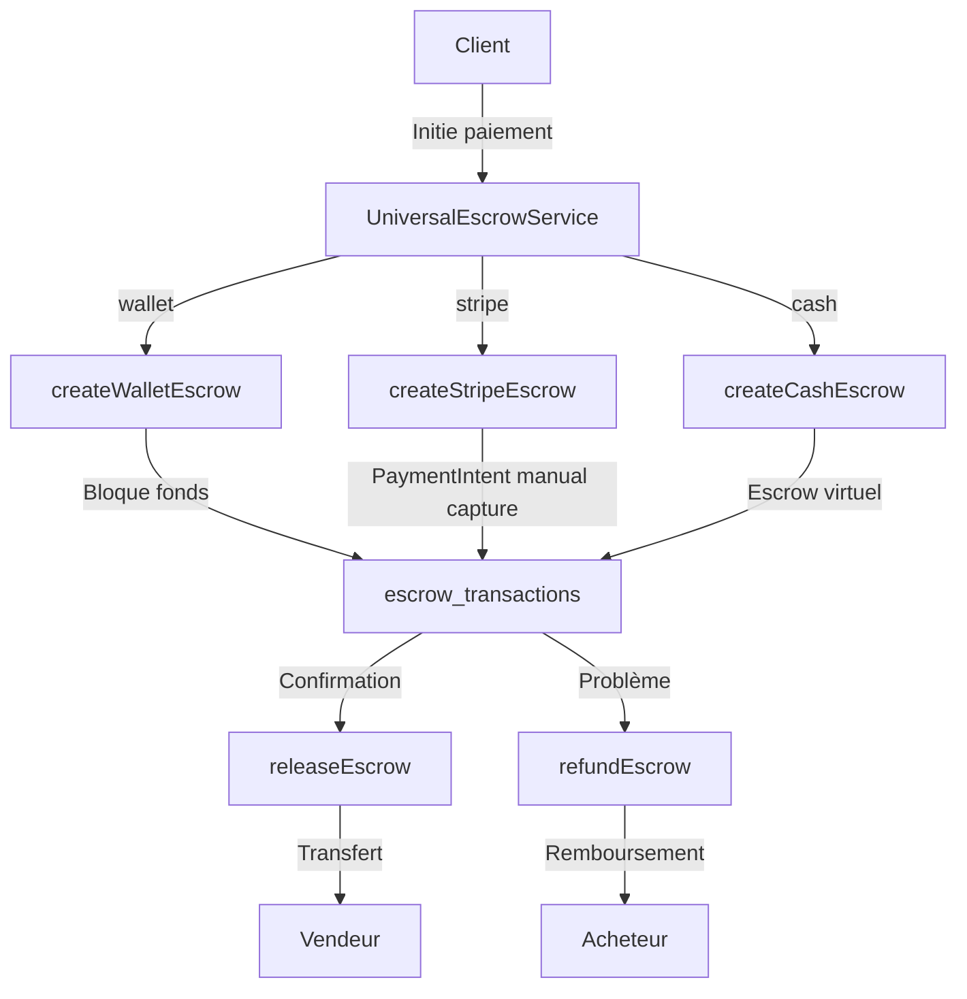

# Système Escrow Universel 224SOLUTIONS

## Vue d'ensemble

Le système Escrow Universel permet de sécuriser **tous les paiements** sur la plateforme 224SOLUTIONS, quel que soit le type de transaction (produits, taxi-moto, livraisons, services).

## Fonctionnalités principales

### ✅ Protection des transactions
- **Blocage sécurisé des fonds** jusqu'à confirmation de la transaction
- Support de **multiples providers** de paiement (Wallet, Stripe, Cash, Moneroo)
- **Libération automatique** ou manuelle des fonds
- **Remboursement** en cas de litige

### 🔒 Types de transactions supportés
- `product` - Achat de produits sur le marketplace
- `taxi` - Courses de taxi-moto
- `delivery` - Livraisons
- `service` - Services divers
- `wallet_transfer` - Transferts wallet (escrow optionnel)

### 💳 Providers de paiement supportés
- `wallet` - Wallet 224Solutions (escrow via blocage de fonds)
- `stripe` - Carte bancaire (escrow via capture manuelle PaymentIntent)
- `cash` - Espèces (escrow virtuel pour paiement à la livraison)
- `moneroo` - Orange Money, MTN Money (en cours d'intégration)

## Architecture



## Installation et utilisation

### 1. Service UniversalEscrowService

```typescript
import { UniversalEscrowService } from '@/services/UniversalEscrowService';

// Créer un escrow
const result = await UniversalEscrowService.createEscrow({
  buyer_id: 'user_123',
  seller_id: 'vendor_456',
  order_id: 'order_789',
  amount: 50000,
  currency: 'GNF',
  transaction_type: 'product',
  payment_provider: 'wallet',
  metadata: {
    product_ids: ['prod_1', 'prod_2'],
    description: 'Achat de 2 produits'
  },
  escrow_options: {
    auto_release_days: 7,
    commission_percent: 2.5
  }
});

if (result.success) {
  console.log('Escrow créé:', result.escrow_id);
}
```

### 2. Hook useUniversalEscrow

```typescript
import { useUniversalEscrow } from '@/hooks/useUniversalEscrow';

function MyPaymentComponent() {
  const { createEscrow, creating, releaseEscrow, refundEscrow } = useUniversalEscrow();
  
  const handlePayment = async () => {
    const result = await createEscrow({
      buyer_id: userId,
      seller_id: vendorId,
      amount: 50000,
      transaction_type: 'product',
      payment_provider: 'wallet'
    });
    
    // result.success, result.escrow_id
  };
  
  return (
    <Button onClick={handlePayment} disabled={creating}>
      {creating ? 'Paiement en cours...' : 'Payer'}
    </Button>
  );
}
```

### 3. Composant EscrowPaymentWrapper

Wrapper visuel pour intégrer l'escrow dans n'importe quel flux de paiement :

```typescript
import { EscrowPaymentWrapper } from '@/components/payment/EscrowPaymentWrapper';

function ProductCheckout() {
  return (
    <EscrowPaymentWrapper
      transaction={{
        buyer_id: userId,
        seller_id: vendorId,
        amount: 50000,
        currency: 'GNF',
        order_id: orderId,
        transaction_type: 'product',
        payment_provider: 'wallet',
        description: 'Achat produit X'
      }}
      enabled={true}
      showConfirmDialog={true}
      onSuccess={(escrow_id) => {
        console.log('Escrow créé:', escrow_id);
      }}
      onError={(error) => {
        console.error('Erreur:', error);
      }}
      onComplete={() => {
        // Rediriger ou afficher confirmation
      }}
    >
      <Button>Payer maintenant</Button>
    </EscrowPaymentWrapper>
  );
}
```

## Intégration dans les composants existants

### Produits (Marketplace)

```typescript
// Dans ProductPaymentModal.tsx
const escrowResult = await UniversalEscrowService.createEscrow({
  buyer_id: userId,
  seller_id: vendorData.user_id,
  order_id: orderData.id,
  amount: vendorTotal,
  currency: 'GNF',
  transaction_type: 'product',
  payment_provider: paymentMethod === 'wallet' ? 'wallet' : 'cash',
  metadata: {
    product_ids: items.map(i => i.id),
    description: `Achat produits (${items.length} articles)`
  }
});
```

### Taxi-Moto

```typescript
// Dans TaxiMotoPayment.tsx
const escrowResult = await UniversalEscrowService.createEscrow({
  buyer_id: customerId,
  seller_id: driverId,
  amount: rideAmount,
  currency: 'GNF',
  transaction_type: 'taxi',
  payment_provider: selectedPaymentMethod,
  metadata: {
    ride_id: rideId,
    distance: ride.distance,
    description: `Course ${ride.pickup_location} → ${ride.dropoff_location}`
  }
});
```

### Livraisons

```typescript
// Dans DeliveryPayment.tsx
const escrowResult = await UniversalEscrowService.createEscrow({
  buyer_id: senderId,
  seller_id: deliveryManId,
  amount: deliveryPrice,
  currency: 'GNF',
  transaction_type: 'delivery',
  payment_provider: 'wallet',
  metadata: {
    delivery_id: deliveryId,
    description: `Livraison ${pickup} → ${destination}`
  }
});
```

## Gestion des escrows

### Libération des fonds (par Admin/CEO ou auto)

```typescript
// Libération manuelle par admin
const result = await UniversalEscrowService.releaseEscrow(
  escrow_id,
  'Livraison confirmée par le client'
);

// Ou via le hook
const { releaseEscrow } = useUniversalEscrow();
await releaseEscrow(escrow_id, 'Notes optionnelles');
```

### Remboursement

```typescript
// Remboursement par admin en cas de litige
const result = await UniversalEscrowService.refundEscrow(
  escrow_id,
  'Produit non conforme - remboursement client'
);

// Ou via le hook
const { refundEscrow } = useUniversalEscrow();
await refundEscrow(escrow_id, 'Raison du remboursement');
```

### Statut d'un escrow

```typescript
const status = await UniversalEscrowService.getEscrowStatus(escrow_id);
console.log(status);
// {
//   escrow_id: "xxx",
//   status: "held",
//   amount: 50000,
//   created_at: "2025-01-01T00:00:00Z",
//   can_release: true,
//   can_refund: true,
//   can_dispute: true
// }
```

### Liste des escrows d'un utilisateur

```typescript
// Tous les escrows
const escrows = await UniversalEscrowService.getUserEscrows(userId);

// Filtrer par type et statut
const productEscrows = await UniversalEscrowService.getUserEscrows(userId, {
  transaction_type: 'product',
  status: 'held'
});
```

## Edge Functions

### escrow-create-stripe
Crée un escrow avec Stripe (capture manuelle de PaymentIntent)

### escrow-release
Libère les fonds d'un escrow (admin/CEO uniquement)

### escrow-refund
Rembourse un escrow (admin/CEO uniquement)

### escrow-stripe-webhook
Synchronise les événements Stripe (payment_intent.succeeded, charge.refunded, etc.)

### escrow-auto-release
Libération automatique après X jours (cron job)

## Base de données

### Table: escrow_transactions

```sql
CREATE TABLE public.escrow_transactions (
  id UUID PRIMARY KEY,
  payer_id UUID NOT NULL,
  receiver_id UUID NOT NULL,
  order_id UUID,
  amount NUMERIC(14,2) NOT NULL,
  currency TEXT DEFAULT 'GNF',
  status TEXT NOT NULL, -- 'pending', 'held', 'released', 'refunded', 'disputed'
  stripe_payment_intent_id TEXT,
  stripe_charge_id TEXT,
  stripe_refund_id TEXT,
  metadata JSONB,
  created_at TIMESTAMPTZ DEFAULT NOW(),
  released_at TIMESTAMPTZ,
  refunded_at TIMESTAMPTZ,
  notes TEXT
);
```

### Table: escrow_action_logs

```sql
CREATE TABLE public.escrow_action_logs (
  id UUID PRIMARY KEY,
  escrow_id UUID REFERENCES escrow_transactions(id),
  action_type TEXT NOT NULL,
  performed_by UUID,
  performed_at TIMESTAMPTZ DEFAULT NOW(),
  notes TEXT,
  metadata JSONB
);
```

## Sécurité

### Contrôles d'accès
- **Création d'escrow**: Authentification requise (buyer ou système)
- **Libération**: Admin/CEO uniquement (ou auto-release)
- **Remboursement**: Admin/CEO uniquement
- **Consultation**: Propriétaire de la transaction uniquement

### Validation
- Montants > 0
- IDs valides (buyer, seller)
- Solde suffisant pour wallet
- PaymentIntent valide pour Stripe

### Logs et audit
Toutes les actions sont loggées dans `escrow_action_logs` avec:
- Qui a effectué l'action
- Quand
- Pourquoi (notes)
- Métadonnées additionnelles

## Calcul des frais

```typescript
const fees = UniversalEscrowService.calculateEscrowFees(50000, 2.5);
// {
//   amount: 50000,
//   fee: 1250,  // 2.5% de commission
//   total: 51250,  // Ce que paie l'acheteur
//   seller_receives: 48750  // Ce que reçoit le vendeur
// }
```

## Configuration

Les commissions peuvent être configurées par type de transaction:

```typescript
escrow_options: {
  auto_release_days: 7,  // Libération auto après 7 jours
  commission_percent: 2.5,  // 2.5% de commission
  require_signature: true,  // Signature requise pour libération
  require_photo: false  // Photo de livraison requise
}
```

## Tests

```typescript
// Test de création
const testEscrow = async () => {
  const result = await UniversalEscrowService.createEscrow({
    buyer_id: 'test_buyer',
    seller_id: 'test_seller',
    amount: 1000,
    transaction_type: 'product',
    payment_provider: 'wallet'
  });
  
  expect(result.success).toBe(true);
  expect(result.escrow_id).toBeDefined();
};
```

## Support et maintenance

Pour toute question ou problème:
1. Vérifier les logs dans `escrow_action_logs`
2. Consulter les logs des Edge Functions
3. Vérifier le statut de l'escrow via `getEscrowStatus()`
4. Contacter l'équipe technique 224SOLUTIONS
