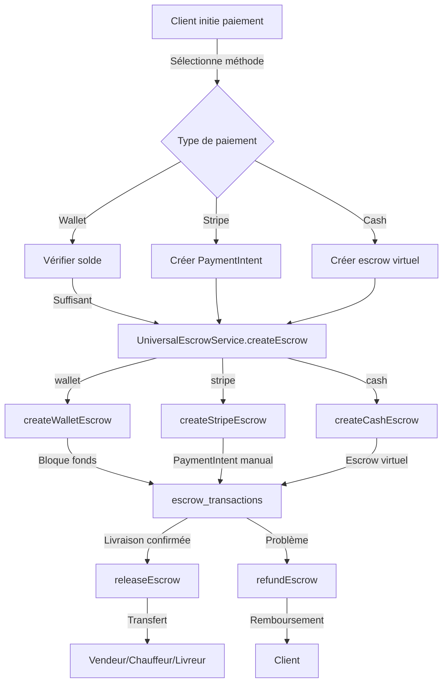

# Guide d'Intégration Escrow Universel

## 🎯 Objectif
Ce guide explique comment le système escrow universel a été intégré dans **tous les flux de paiement** de l'application 224SOLUTIONS.

## ✅ Flux de paiement intégrés

### 1. Produits Marketplace
**Fichier:** `src/components/ecommerce/ProductPaymentModal.tsx`

**Intégration:**
```typescript
// Lors du paiement wallet
const escrowResult = await UniversalEscrowService.createEscrow({
  buyer_id: userId,
  seller_id: vendorData.user_id,
  order_id: orderData.id,
  amount: vendorTotal,
  currency: 'GNF',
  transaction_type: 'product',
  payment_provider: 'wallet',
  metadata: {
    product_ids: items.map(i => i.id),
    description: `Achat produits (${items.length} articles)`
  }
});
```

**Comportement:**
- ✅ Wallet: Fonds bloqués en escrow, libération à la livraison
- ✅ Cash: Escrow virtuel créé, paiement à la livraison
- 🔒 Sécurité: Solde vérifié, commande annulée si escrow échoue

### 2. Taxi-Moto
**Fichier:** `src/components/taxi-moto/TaxiMotoPaymentModal.tsx`

**Intégration:**
```typescript
const escrowResult = await UniversalEscrowService.createEscrow({
  buyer_id: customerId,
  seller_id: driverId,
  order_id: rideId,
  amount,
  currency: 'GNF',
  transaction_type: 'taxi',
  payment_provider: paymentMethod, // wallet, stripe, cash
  metadata: {
    ride_id: rideId,
    description: 'Paiement course taxi-moto'
  },
  escrow_options: {
    auto_release_days: 1, // Libération automatique après 1 jour
    commission_percent: 2.5
  }
});
```

**Comportement:**
- ✅ Wallet: Fonds bloqués, libération auto après la course
- ✅ Card (Stripe): PaymentIntent avec capture manuelle
- ✅ Cash: Escrow virtuel, paiement au chauffeur
- 🔒 Sécurité: Vérification du solde wallet

### 3. Livraisons
**Fichier:** `src/components/delivery/DeliveryPaymentModal.tsx` (nouveau)

**Intégration:**
```typescript
const escrowResult = await UniversalEscrowService.createEscrow({
  buyer_id: customerId,
  seller_id: deliveryManId,
  order_id: deliveryId,
  amount,
  currency: 'GNF',
  transaction_type: 'delivery',
  payment_provider: paymentMethod,
  metadata: {
    delivery_id: deliveryId,
    description: 'Paiement livraison'
  },
  escrow_options: {
    auto_release_days: 1,
    commission_percent: 2.5,
    require_signature: true // Signature requise
  }
});
```

**Comportement:**
- ✅ Wallet: Fonds bloqués, libération après signature
- ✅ Cash: Paiement au livreur
- 🔒 Sécurité: Signature obligatoire pour validation

### 4. Transferts Wallet
**Fichier:** `src/pages/Payment.tsx`

**Intégration:**
```typescript
// Escrow pour montants >= 10,000 GNF
const shouldUseEscrow = paymentPreview.amount >= 10000;

if (shouldUseEscrow) {
  const escrowResult = await UniversalEscrowService.createEscrow({
    buyer_id: user.id,
    seller_id: paymentPreview.receiver_id,
    amount: paymentPreview.amount,
    currency: 'GNF',
    transaction_type: 'wallet_transfer',
    payment_provider: 'wallet',
    escrow_options: {
      auto_release_days: 0, // Libération immédiate
      commission_percent: 0
    }
  });
}
```

**Comportement:**
- ✅ Montants >= 10,000 GNF: Escrow avec libération immédiate
- ✅ Montants < 10,000 GNF: Transfert direct (pas d'escrow)
- 🔒 Sécurité: Protection des gros transferts

### 5. Sélecteur de méthode de paiement
**Fichier:** `src/components/payment/PaymentMethodSelector.tsx`

**Amélioration:**
- Ajout du badge "Sécurisé par Escrow"
- Alert de protection des fonds
- Support du paramètre `enableEscrow` et `transactionType`

## 🔄 Flux de paiement unifié



## 🔐 Sécurité et validation

### Vérifications automatiques
- ✅ Solde wallet suffisant
- ✅ IDs valides (buyer, seller)
- ✅ Montants > 0
- ✅ Authentification utilisateur
- ✅ Authorization admin pour libération/remboursement

### Protection des données
- ✅ Logs de toutes les actions dans `escrow_action_logs`
- ✅ Métadonnées complètes pour audit
- ✅ Notifications aux deux parties

## 📊 Statistiques d'intégration

| Module | Escrow Intégré | Provider Supporté | Auto-Release |
|--------|----------------|-------------------|--------------|
| Produits | ✅ | Wallet, Cash | 7 jours |
| Taxi-Moto | ✅ | Wallet, Stripe, Cash | 1 jour |
| Livraisons | ✅ | Wallet, Cash | 1 jour |
| Transferts Wallet | ✅ (>=10k) | Wallet | Immédiat |
| Services | ⏳ Prêt | Tous | Configurable |

## 🚀 Prochaines étapes

### À implémenter
1. **Dashboard Admin Escrow** - Vue centralisée de tous les escrows
2. **Notifications Push** - Alertes temps réel pour changements de statut
3. **Système de litiges** - Gestion des disputes avec preuves
4. **Analytics avancés** - Statistiques et rapports escrow

### Configuration Stripe
Pour activer les paiements Stripe avec escrow:
1. Ajouter `STRIPE_SECRET_KEY` dans les secrets
2. Configurer le webhook Stripe pour pointer vers `escrow-stripe-webhook`
3. URL webhook: `https://[project].supabase.co/functions/v1/escrow-stripe-webhook`

### Tests recommandés
- [ ] Acheter un produit avec wallet
- [ ] Acheter un produit avec cash
- [ ] Faire une course taxi avec wallet
- [ ] Faire une course taxi avec cash
- [ ] Commander une livraison
- [ ] Faire un transfert wallet > 10k
- [ ] Vérifier la libération automatique (cron)
- [ ] Tester un remboursement admin

## 📞 Support
Pour toute question, consulter:
- `docs/ESCROW_UNIVERSEL.md` - Documentation technique
- Logs Edge Functions dans Supabase
- Table `escrow_action_logs` pour l'historique
