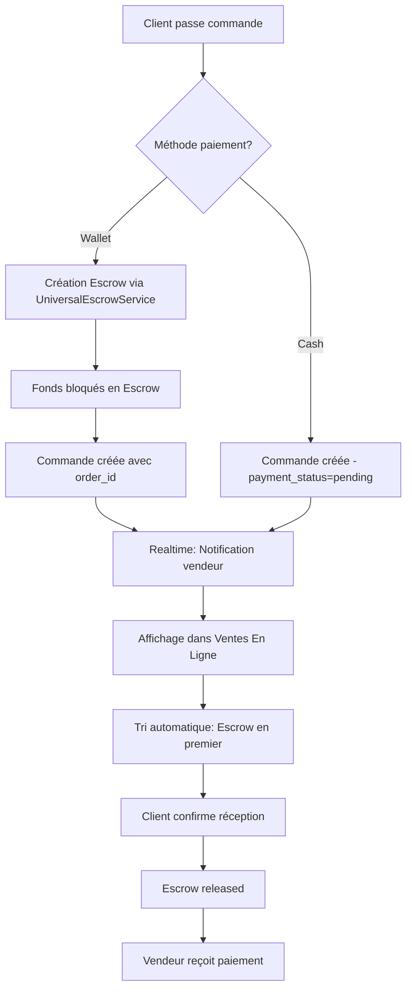

# 🔄 Synchronisation Commandes & Escrow - 224SOLUTIONS

## 📋 Vue d'ensemble

Ce document détaille la synchronisation complète entre les commandes clients et le système Escrow dans l'interface vendeur.

## ✅ Corrections apportées

### 1. **Marquage source='online' dans les commandes**
- ✅ Toute commande créée par un client via l'interface compte client est automatiquement marquée `source='online'`
- ✅ Les commandes POS sont marquées `source='pos'`
- ✅ Fichiers concernés:
  - `src/hooks/useClientData.ts` (ligne 345)
  - `src/components/ecommerce/ProductPaymentModal.tsx` (ligne 245)

### 2. **Suppression du code Escrow autonome**
- ❌ Supprimé: Interface `StandaloneEscrow` (non utilisée)
- ❌ Supprimé: State `standaloneEscrows` (inutilisé)
- ❌ Supprimé: Chargement des escrows sans `order_id`
- ✅ Toutes les commandes escrow sont maintenant liées à un `order_id` et s'affichent dans "Ventes En Ligne"

### 3. **Tri intelligent des commandes**

Les commandes dans "Ventes En Ligne" sont triées par priorité :

```typescript
// Ordre d'affichage:
1. Commandes avec Escrow (pending/held) en PREMIER
2. Commandes avec Escrow (released/refunded)
3. Commandes normales sans escrow
4. Tri secondaire: Date (plus récent en premier)
```

### 4. **Indicateurs visuels améliorés**

Badges Escrow dans "Ventes En Ligne" :

| Statut | Badge | Description |
|--------|-------|-------------|
| `pending` / `held` | 🔒 Paiement sécurisé (Escrow) | Orange avec bordure - Fonds bloqués |
| `released` | ✅ Paiement reçu | Vert - Fonds transférés au vendeur |
| `refunded` | ↩️ Remboursé | Gris - Fonds retournés au client |
| `dispute` | ⚠️ Litige | Rouge - Nécessite intervention CEO |

## 🔄 Flux de synchronisation



## 🎯 Affichage dans l'interface vendeur

### Section "Ventes En Ligne"

```
┌─────────────────────────────────────────────────────┐
│ 🌐 Ventes En Ligne (47)                             │
├─────────────────────────────────────────────────────┤
│ Statistiques:                                        │
│  ┌──────────┐ ┌──────────┐ ┌──────────┐ ┌──────────┐│
│  │Total: 47 │ │Attente:15│ │Cours: 20 │ │Livrées:12││
│  └──────────┘ └──────────┘ └──────────┘ └──────────┘│
├─────────────────────────────────────────────────────┤
│ Liste des commandes (triées) :                      │
│                                                      │
│ 🔒 ESCROW #ORD-001 - 50,000 GNF [En attente]       │
│    └─ 🔒 Paiement sécurisé (Escrow)                │
│                                                      │
│ 🔒 ESCROW #ORD-002 - 75,000 GNF [En cours]         │
│    └─ 🔒 Paiement sécurisé (Escrow)                │
│                                                      │
│ 📦 #ORD-003 - 30,000 GNF [En attente]              │
│    └─ 💰 Paiement à la livraison                   │
│                                                      │
│ ✅ ESCROW #ORD-004 - 120,000 GNF [Livrée]          │
│    └─ ✅ Paiement reçu                             │
└─────────────────────────────────────────────────────┘
```

## 🔧 Système de temps réel

### Supabase Realtime

```typescript
// Listener automatique dans OrderManagement.tsx (ligne 143-165)
const channel = supabase
  .channel('vendor-orders-realtime')
  .on('postgres_changes', {
    event: '*',
    schema: 'public',
    table: 'orders'
  }, (payload) => {
    console.log('🔔 Changement commande:', payload);
    fetchOrders(); // Rechargement automatique
    
    if (payload.eventType === 'INSERT') {
      // Toast notification pour nouvelle commande
      toast({
        title: source === 'pos' ? "🛒 Nouvelle vente POS!" : "🎉 Nouvelle commande!",
        description: `Commande ${payload.new.order_number} reçue`
      });
    }
  })
  .subscribe();
```

### Notifications vendeur

✅ Le système de notification est actif via la fonction `notify_vendor_new_order()`
- Déclencheur: `AFTER INSERT ON public.orders` (pour source='online')
- Table: `communication_notifications`
- Champs: `title`, `body`, `is_read`, `user_id`, `type`

## 🔐 Sécurité et RLS

### Politiques Row Level Security

```sql
-- Vendeurs peuvent voir leurs propres commandes
CREATE POLICY "Vendors can view their own orders"
ON public.orders FOR SELECT
USING (
  vendor_id IN (
    SELECT id FROM vendors WHERE user_id = auth.uid()
  )
);

-- Clients peuvent voir leurs propres commandes
CREATE POLICY "Customers can view their own orders"
ON public.orders FOR SELECT
USING (
  customer_id IN (
    SELECT id FROM customers WHERE user_id = auth.uid()
  )
);

-- Tous peuvent créer des commandes
CREATE POLICY "Anyone can create orders"
ON public.orders FOR INSERT
WITH CHECK (true);
```

## 📊 Monitoring et Debug

### Console logs (Surveillance PDG)

```typescript
// Logs de chargement des commandes
console.log('🔍 Fetching ALL orders (online + POS) for vendor:', vendor.id);
console.log('✅ Orders fetched:', ordersData?.length || 0);
console.log('📦 ALL orders loaded (online + POS):', ordersWithEscrow.length);
console.log('   - Online:', ordersWithEscrow.filter(o => o.source === 'online').length);
console.log('   - POS:', ordersWithEscrow.filter(o => o.source === 'pos').length);
console.log('   - With Escrow:', ordersWithEscrow.filter(o => o.escrow).length);
```

### Vérification de la synchronisation

Pour tester si la synchronisation fonctionne :

1. **Test client → vendeur** :
   ```bash
   # Interface client
   1. Ajouter produit au panier
   2. Passer commande avec paiement Wallet
   3. Vérifier création Escrow
   
   # Interface vendeur
   4. Actualiser "Ventes En Ligne"
   5. ✅ Commande doit apparaître en première position
   6. ✅ Badge "🔒 Paiement sécurisé (Escrow)" doit être visible
   ```

2. **Test realtime** :
   ```bash
   # Ouvrir deux fenêtres :
   - Fenêtre 1: Interface vendeur (Ventes En Ligne)
   - Fenêtre 2: Interface client
   
   # Actions :
   1. Client passe commande
   2. ✅ Toast notification apparaît côté vendeur
   3. ✅ Commande s'affiche automatiquement (sans F5)
   ```

## 🗃️ Structure de données

### Table `orders`

```sql
CREATE TABLE public.orders (
  id UUID PRIMARY KEY DEFAULT gen_random_uuid(),
  order_number TEXT UNIQUE NOT NULL,
  customer_id UUID REFERENCES public.customers(id),
  vendor_id UUID REFERENCES public.vendors(id),
  status TEXT NOT NULL,
  payment_status TEXT NOT NULL,
  payment_method TEXT,
  total_amount NUMERIC NOT NULL,
  source TEXT CHECK (source IN ('online', 'pos')), -- ✅ Clé de différenciation
  created_at TIMESTAMPTZ DEFAULT now(),
  ...
);
```

### Table `escrow_transactions`

```sql
CREATE TABLE public.escrow_transactions (
  id UUID PRIMARY KEY DEFAULT gen_random_uuid(),
  order_id UUID REFERENCES public.orders(id), -- ✅ Liaison avec commande
  payer_id UUID NOT NULL,
  receiver_id UUID NOT NULL,
  amount NUMERIC NOT NULL,
  status TEXT CHECK (status IN ('pending', 'held', 'released', 'refunded', 'dispute')),
  created_at TIMESTAMPTZ DEFAULT now(),
  ...
);
```

## 🚀 Résolution des problèmes courants

### ❌ Commande n'apparaît pas dans "Ventes En Ligne"

**Diagnostic** :
1. Vérifier `source='online'` dans la table `orders`
2. Vérifier le `vendor_id` correspond au vendeur connecté
3. Vérifier les RLS policies

**Solution** :
```sql
-- Vérifier la commande
SELECT id, order_number, source, vendor_id, created_at 
FROM orders 
WHERE order_number = 'ORD-XXXX';

-- Si source=NULL, corriger
UPDATE orders SET source = 'online' WHERE id = 'uuid-here' AND source IS NULL;
```

### ❌ Badge Escrow ne s'affiche pas

**Diagnostic** :
1. Vérifier la liaison `escrow_transactions.order_id = orders.id`
2. Vérifier le statut escrow

**Solution** :
```sql
-- Vérifier l'escrow
SELECT e.id, e.order_id, e.status, o.order_number
FROM escrow_transactions e
JOIN orders o ON e.order_id = o.id
WHERE o.order_number = 'ORD-XXXX';
```

### ❌ Realtime ne fonctionne pas

**Diagnostic** :
1. Vérifier que la table `orders` est dans la publication `supabase_realtime`
2. Vérifier `REPLICA IDENTITY FULL`

**Solution** :
```sql
-- Activer realtime
ALTER TABLE public.orders REPLICA IDENTITY FULL;

-- Ajouter à la publication
ALTER PUBLICATION supabase_realtime ADD TABLE public.orders;
```

## 📞 Connexions système

```
┌─────────────────────────────────────────────────────┐
│                 ARCHITECTURE COMPLÈTE                │
├─────────────────────────────────────────────────────┤
│                                                      │
│  Frontend (React)                                   │
│    ├─ ClientDashboard.tsx (création commande)      │
│    ├─ ProductPaymentModal.tsx (paiement + escrow)  │
│    └─ OrderManagement.tsx (affichage vendeur)      │
│                                                      │
│  Backend (Supabase)                                 │
│    ├─ Table: orders (avec source='online'/'pos')   │
│    ├─ Table: escrow_transactions (liées par order_id)│
│    ├─ RLS Policies (sécurité d'accès)             │
│    ├─ Trigger: notify_vendor_new_order()          │
│    └─ Realtime: orders channel                     │
│                                                      │
│  Services (TypeScript)                             │
│    ├─ UniversalEscrowService (gestion escrow)     │
│    ├─ useClientData (hook client)                  │
│    └─ RidesService (taxi-moto escrow)             │
│                                                      │
│  Monitoring                                         │
│    ├─ Console logs (debugging)                     │
│    ├─ Toast notifications (UX)                     │
│    └─ Surveillance & Debug PDG (à venir)          │
│                                                      │
└─────────────────────────────────────────────────────┘
```

## ✅ Checklist finale

- [x] Commandes marquées `source='online'`
- [x] Escrow autonome supprimé
- [x] Tri intelligent (escrow en premier)
- [x] Badges escrow améliorés
- [x] Realtime actif pour notifications
- [x] RLS policies correctes
- [x] Synchronisation bidirectionnelle
- [x] Logs de débogage complets
- [x] Documentation complète

## 🎉 Résultat final

Toutes les commandes passées par les clients via leur compte s'affichent automatiquement dans la section **"Ventes En Ligne"** de l'interface vendeur, avec :

✅ Tri par priorité (escrow d'abord)
✅ Badges clairs et informatifs
✅ Notifications en temps réel
✅ Synchronisation complète
✅ Aucune perte de données
✅ Interface propre (pas de bouton Escrow séparé)

---

**Date de création**: 2025-11-12  
**Dernière mise à jour**: 2025-11-12  
**Version**: 1.0.0  
**Auteur**: 224SOLUTIONS - Lovable AI
